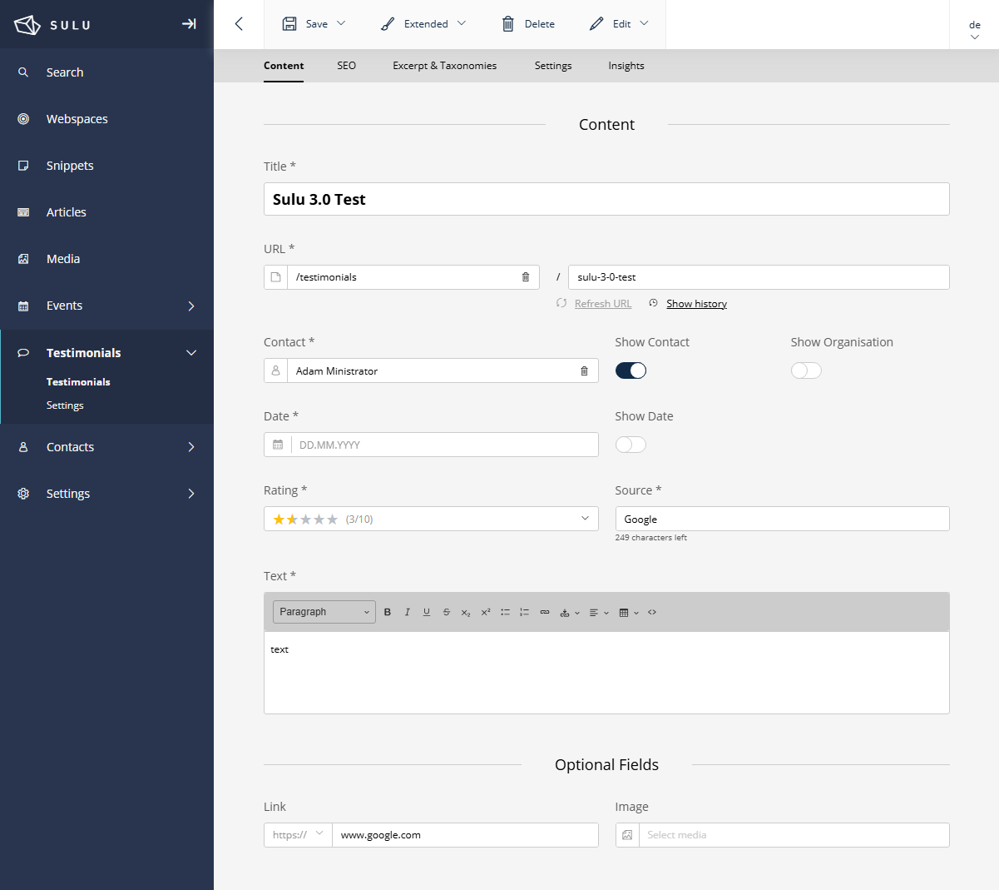

# SuluTestimonialsBundle


[](https://github.com/manuxi/SuluTestimonialsBundle/blob/main/LICENSE)


**English** | [Deutsch](README.de.md)

A Sulu CMS bundle for managing customer testimonials, reviews, and quotes with configurable star ratings.



## ✨ Features

- **Testimonial Management** - Create, edit, and publish customer testimonials
- **Star Rating System** - Configurable 5 or 10 point rating scale with star symbols
- **Contact Integration** - Link testimonials to Sulu contacts
- **Smart Content Provider** - Use testimonials in any Sulu page via Smart Content
- **Selection Content Types** - Single and multiple testimonial selection
- **Workflow Support** - Draft/Published workflow with versioning
- **Multi-language** - Full translation support
- **SEO & Sitemap** - Built-in SEO and sitemap integration
- **Search Integration** - Admin and website search indexes
- **Trash Support** - Restore deleted testimonials
- **Activity Logging** - Track all changes

## Breaking change
- **uuid** - since 1.5.0 (not compatible to previous versions)

## 📋 Requirements

- PHP 8.2+
- Sulu CMS 3.0+
- Symfony 6.4+ / 7.0+

## 👩🏻‍🏭 Installation

### Step 1: Install via Composer

```bash
composer require manuxi/sulu-testimonials-bundle
```

### Step 2: Register the Bundle

If not using Symfony Flex, add to `config/bundles.php`:

```php
return [
    // ...
    Manuxi\SuluTestimonialsBundle\SuluTestimonialsBundle::class => ['all' => true],
];
```

### Step 3: Configure Routes

Add to `config/routes/sulu_admin.yaml`:

```yaml
SuluTestimonialsBundle:
    resource: '@SuluTestimonialsBundle/Resources/config/routes_admin.yaml'
```

### Step 4: Update Database

```bash
# Preview changes
php bin/console doctrine:schema:update --dump-sql

# Apply changes
php bin/console doctrine:schema:update --force
```

### Step 5: Build Admin Assets

```bash
cd assets/admin
npm install
npm run build
```

### Step 6: Grant Permissions

1. Go to **Settings → User Roles** in Sulu Admin
2. Select the appropriate role
3. Enable permissions for **Testimonials**
4. Save and reload

## 🧶 Configuration

Create `config/packages/sulu_testimonials.yaml`:

```yaml
sulu_testimonials:
    rating:
        max_value: 5            # 5 or 10 point scale
        default_value: 3        # Default rating for new testimonials
        use_star_symbols: true  # Show stars in admin dropdown
        use_star_widget: false  # Use interactive star widget (future)
```

See [Configuration Documentation](docs/configuration.en.md) for all options.

## 🎣 Usage

### Smart Content

Use testimonials in any page template:

```xml
<property name="testimonials" type="smart_content">
    <meta>
        <title lang="en">Testimonials</title>
        <title lang="de">Testimonials</title>
    </meta>
    <params>
        <param name="provider" value="testimonials"/>
        <param name="max_per_page" value="5"/>
        <param name="page_parameter" value="page"/>
    </params>
</property>
```

### Selection Types

Single testimonial:

```xml
<property name="featured_testimonial" type="single_testimonial_selection">
    <meta>
        <title lang="en">Featured Testimonial</title>
    </meta>
</property>
```

Multiple testimonials:

```xml
<property name="testimonials" type="testimonial_selection">
    <meta>
        <title lang="en">Testimonials</title>
    </meta>
</property>
```

### Twig Template

```twig

    <div class="testimonial">
        <blockquote>{{ testimonial.text|raw }}</blockquote>
        
        
            <cite>{{ testimonial.contact.fullName }}</cite>
        
        
        {# Rating display - uses global variable #}
        
            
            <div class="rating">
                {{ testimonial.rating }}/{{ maxRating }}
            </div>
        
    </div>

```

## 📖 Documentation

- [Installation](docs/installation.en.md)
- [Configuration](docs/configuration.en.md)
- [Usage & Templates](docs/usage.en.md)
- [Rating System](docs/rating.en.md)
- [Admin List Customization](docs/admin-list.en.md)

## 🔌 Optional Integrations

### Star Rating in Admin Lists

If you have [SuluTweaksBundle](https://github.com/manuxi/SuluTweaksBundle) installed, you can enable star rating display in admin lists. See [Admin List Documentation](docs/admin-list.en.md).

## 👩‍🍳 Contributing

Contributions are welcome! Please feel free to submit issues or pull requests.

## 📄 License

This bundle is released under the [MIT License](LICENSE).