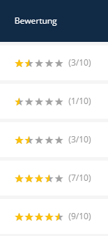

# Admin-Listen-Anpassung

[← Zurück zur README](../README.de.md)

## Bewertungsanzeige in Admin-Listen

Standardmäßig wird die Bewertung als einfache Zahl in Admin-Listen angezeigt. Dies kann mit Sternebewertungen über das optionale [SuluTweaksBundle](https://github.com/manuxi/SuluTweaksBundle) verbessert werden.

## SuluTweaksBundle verwenden (Optional)

### Installation

```bash
composer require manuxi/sulu-tweaks-bundle
```

### Star Rating Transformer aktivieren

`config/packages/sulu_tweaks.yaml` bearbeiten:

```yaml
sulu_tweaks:
    star_rating:
        show_value: true      # Numerischen Wert neben Sternen anzeigen
        max_value: 10         # Muss mit sulu_testimonials.rating.max_value übereinstimmen
```

### In Listen-Konfiguration aktivieren

Das Bundle enthält auskommentierte Transformer-Hinweise in den Listen-XML-Dateien. Zum Aktivieren:

**Option 1: Im Projekt überschreiben**

Die Listen-XML ins Projekt kopieren und den Transformer einkommentieren:

```bash
mkdir -p config/lists
cp vendor/manuxi/sulu-testimonials-bundle/src/Resources/config/lists/testimonials.xml \
   config/lists/testimonials.xml
```

Dann `config/lists/testimonials.xml` bearbeiten:

```xml
<property name="rating" translation="sulu_testimonials.rating" visibility="yes" sortable="true">
    <field-name>rating</field-name>
    <entity-name>dimensionContent</entity-name>
    <joins ref="dimensionContent"/>
    <transformer type="star_rating">
        <params>
            <param name="max_value" value="10"/>
            <param name="show_value" value="true"/>
        </params>
    </transformer>
</property>
```

**Option 2: Globale TweaksBundle-Konfiguration nutzen**

Wenn `max_value` mit der globalen TweaksBundle-Konfiguration übereinstimmt, können die Parameter weggelassen werden:

```xml
<transformer type="star_rating"/>
```

## Ergebnis

Mit aktiviertem Star Rating Transformer:



| Ohne Transformer | Mit Transformer |
|------------------|-----------------|
| `7` | ★★★⯪☆ (7/10) |
| `5` | ★★⯪☆☆ (5/10) |
| `10` | ★★★★★ (10/10) |

## Weitere Listen-Anpassungen

### Publish State Indicator

Das Bundle unterstützt auch den `publish_state_indicator` Transformer aus dem TweaksBundle:

```xml
<property name="publishedState" translation="sulu_admin.publish_state_indicator" visibility="always">
    <field-name>workflowPlace</field-name>
    <entity-name>dimensionContent</entity-name>
    <joins ref="dimensionContent"/>
    <transformer type="publish_state_indicator"/>
</property>
```

### Ghost Locale Indicator

Für mehrsprachige Setups:

```xml
<property name="ghostLocale" translation="sulu_tweaks.ghost_locale" visibility="always">
    <field-name>ghostLocale</field-name>
    <transformer type="ghost_locale_indicator"/>
</property>
```

## Ohne SuluTweaksBundle

Falls das SuluTweaksBundle nicht installiert werden soll, kann ein eigener List Field Transformer erstellt werden. Siehe [Sulu-Dokumentation](https://docs.sulu.io/en/2.x/book/extend-admin.html#list-field-transformers) für Details.

## Bundle Listen-Dateien

Das Bundle enthält diese Listen-Konfigurationen:

| Datei | Zweck |
|-------|-------|
| `testimonials.xml` | Haupt-Admin-Liste (alle Status) |
| `testimonials_published.xml` | Nur veröffentlichte Testimonials (für Overlays/Auswahlen) |

Beide Dateien enthalten auskommentierte Hinweise für den Star Rating Transformer.
