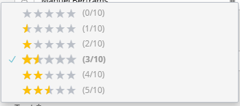
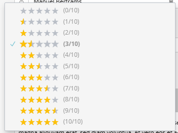

# Konfiguration

[← Zurück zur README](../README.de.md)

## Bundle-Konfiguration

`config/packages/sulu_testimonials.yaml` im Projekt erstellen:

```yaml
sulu_testimonials:
    rating:
        max_value: 5            # Bewertungsskala (5 oder 10)
        default_value: 3        # Standardwert für neue Testimonials
        use_star_symbols: true  # Sterne im Admin-Dropdown anzeigen
        use_star_widget: false  # Interaktives Sterne-Widget (für zukünftige Nutzung reserviert)
```

## Konfigurationsoptionen

### Bewertungsskala (`max_value`)

| Wert | Beschreibung | Admin-Anzeige | Frontend-Anzeige |
|------|--------------|---------------|------------------|
| `5` | 5-Punkte-Skala | 0-5 | ★★★★★ |
| `10` | 10-Punkte-Skala | 0-10 | ★★★★★ (mit halben Sternen) |

Die 10-Punkte-Skala wird als 5 Sterne mit Halbstern-Abstufungen angezeigt (0,5 = ⯪).

### Standardwert (`default_value`)

Die vorausgewählte Bewertung beim Erstellen eines neuen Testimonials. Muss innerhalb des konfigurierten `max_value` liegen.

### Sternsymbole (`use_star_symbols`)

Bei `true` zeigt das Admin-Dropdown Sternsymbole an:

**5-Punkte-Skala:**
```
☆☆☆☆☆ (0/5)
★☆☆☆☆ (1/5)
★★☆☆☆ (2/5)
★★★☆☆ (3/5)
★★★★☆ (4/5)
★★★★★ (5/5)
```

**10-Punkte-Skala:**
```
☆☆☆☆☆ (0/10)
⯪☆☆☆☆ (1/10)
★☆☆☆☆ (2/10)
★⯪☆☆☆ (3/10)
...
★★★★★ (10/10)
```

Bei `false` wird einfacher Text angezeigt: "0 stars", "1 star", "2 stars", etc.

## Twig Globale Variable

Das Bundle stellt eine globale Twig-Variable für den Zugriff auf die konfigurierte Bewertungsskala bereit:

```twig
{{ testimonials_rating_max_value }}  {# Gibt 5 oder 10 zurück #}
```

Diese Variable ist in allen Kontexten verfügbar:
- Smart Content Templates
- Selection Templates  
- Direkte Controller-Templates
- Eigene Twig-Templates

## Beispiel: Verschiedene Skalen

### 5-Sterne-Skala (Standard)

```yaml
sulu_testimonials:
    rating:
        max_value: 5
        default_value: 3
        use_star_symbols: true
```



### 10-Punkte-Skala

```yaml
sulu_testimonials:
    rating:
        max_value: 10
        default_value: 7
        use_star_symbols: true
```



## Übersetzungen überschreiben

Die Bewertungslabels können im Projekt überschrieben werden:

```yaml
# translations/admin.de.yaml
sulu_testimonials:
    rates:
        default:
            0: "Keine Bewertung"
            1: "Mangelhaft"
            2: "Ausreichend"
            3: "Befriedigend"
            4: "Gut"
            5: "Sehr gut"
```

Für die 10-Punkte-Skala mit Sternen:

```yaml
# translations/admin.de.yaml
sulu_testimonials:
    rates:
        ten:
            0: "☆☆☆☆☆ (0/10)"
            1: "⯪☆☆☆☆ (1/10)"
            # ... etc
```
