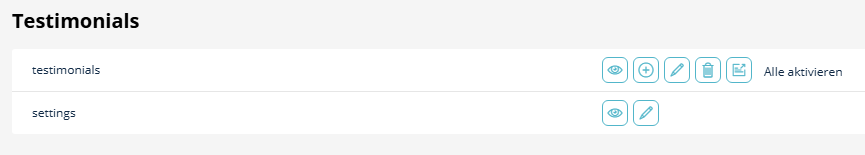
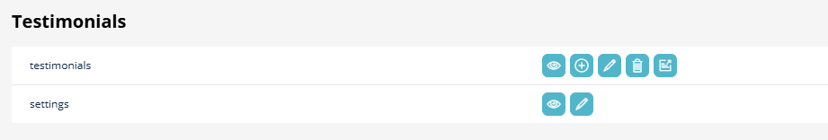

# Installation

[← Back to README](../README.md)

## Requirements

- PHP 8.2 or higher
- Sulu CMS 3.0 or higher
- Symfony 6.4 / 7.0 or higher
- MySQL 5.7+ / MariaDB 10.2+ / PostgreSQL 11+

## Step-by-Step Installation

### 1. Install via Composer

```bash
composer require manuxi/sulu-testimonials-bundle
```

### 2. Register the Bundle

If you're **not** using Symfony Flex, add the bundle to `config/bundles.php`:

```php
<?php

return [
    // ... other bundles
    Manuxi\SuluTestimonialsBundle\SuluTestimonialsBundle::class => ['all' => true],
];
```

### 3. Configure Admin Routes

Add to `config/routes/sulu_admin.yaml`:

```yaml
SuluTestimonialsBundle:
    resource: '@SuluTestimonialsBundle/Resources/config/routes_admin.yaml'
```

### 4. Configure Website Routes (Optional)

If you want to use the testimonial detail pages with their own URLs, add to `config/routes/sulu_website.yaml`:

```yaml
SuluTestimonialsBundle:
    resource: '@SuluTestimonialsBundle/Resources/config/routes_website.yaml'
```

### 5. Configure Search Index

Add the testimonials index to `config/packages/sulu_search.yaml`:

```yaml
sulu_search:
    website:
        indexes:
            - testimonials
            # - testimonials_draft  # Optional: include drafts in search
```

### 6. Update Database Schema

Preview the changes:

```bash
php bin/console doctrine:schema:update --dump-sql
```

Apply the changes:

```bash
php bin/console doctrine:schema:update --force
```

**Tables created:**
- `te_testimonials` - Main testimonial entity
- `te_testimonials_dimension_content` - Dimension content (translations, stages)
- `te_testimonials_settings` - Bundle settings

### 7. Build Admin Assets

```bash
cd assets/admin
npm install
npm run build
```

### 8. Clear Cache

```bash
php bin/console cache:clear
```

### 9. Grant Permissions

1. Log into Sulu Admin
2. Navigate to **Settings → User Roles**
3. Select the role that should manage testimonials
4. Find **Testimonials** in the permissions list
5. Enable the desired permissions:
   - **View**: Can see testimonials
   - **Add**: Can create new testimonials
   - **Edit**: Can modify existing testimonials
   - **Delete**: Can remove testimonials
   - **Live**: Can publish testimonials
6. Save and reload the page




## Verify Installation

After installation, you should see:

1. **Testimonials** item in the main navigation
2. Ability to create new testimonials
3. Smart Content provider "testimonials" available in page templates

## Troubleshooting

### Bundle not appearing in navigation

- Clear the cache: `php bin/console cache:clear`
- Rebuild admin assets: `cd assets/admin && npm run build`
- Check that permissions are granted for your user role

### Database errors

- Ensure you ran the schema update
- Check that all migrations are applied

### Admin JS errors

- Run `npm install` in `assets/admin`
- Rebuild with `npm run build`
- Clear browser cache

### Search not working

- Verify the search index is configured in `sulu_search.yaml`
- Rebuild search index: `php bin/console sulu:search:reindex`

## Upgrading

When upgrading to a new version:

```bash
composer update manuxi/sulu-testimonials-bundle
php bin/console doctrine:schema:update --force
cd assets/admin && npm install && npm run build
php bin/console cache:clear
```

## Uninstalling

1. Remove from `config/bundles.php`
2. Remove route configurations
3. Remove `config/packages/sulu_testimonials.yaml`
4. Drop database tables (backup first!)
5. Run `composer remove manuxi/sulu-testimonials-bundle`
