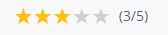
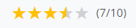

# Bewertungssystem

[← Zurück zur README](../README.de.md)

## Übersicht

Das Testimonial-Bewertungssystem unterstützt zwei Skalen:
- **5-Punkte-Skala**: Einfache 1-5 Sterne-Bewertung
- **10-Punkte-Skala**: 1-10 Bewertung als 5 Sterne mit Halbstern-Abstufungen

## Konfiguration

```yaml
# config/packages/sulu_testimonials.yaml
sulu_testimonials:
    rating:
        max_value: 10           # 5 oder 10
        default_value: 7        # Vorausgewählter Wert für neue Testimonials
        use_star_symbols: true  # Sterne im Admin-Dropdown anzeigen
```

## Bewertungsanzeige-Logik

### 5-Punkte-Skala


| Bewertung | Sterne | Anzeige |
|-----------|--------|---------|
| 0 | ☆☆☆☆☆ | 0/5 |
| 1 | ★☆☆☆☆ | 1/5 |
| 2 | ★★☆☆☆ | 2/5 |
| 3 | ★★★☆☆ | 3/5 |
| 4 | ★★★★☆ | 4/5 |
| 5 | ★★★★★ | 5/5 |

### 10-Punkte-Skala


| Bewertung | Sterne | Anzeige |
|-----------|--------|---------|
| 0 | ☆☆☆☆☆ | 0/10 |
| 1 | ⯪☆☆☆☆ | 1/10 |
| 2 | ★☆☆☆☆ | 2/10 |
| 3 | ★⯪☆☆☆ | 3/10 |
| 4 | ★★☆☆☆ | 4/10 |
| 5 | ★★⯪☆☆ | 5/10 |
| 6 | ★★★☆☆ | 6/10 |
| 7 | ★★★⯪☆ | 7/10 |
| 8 | ★★★★☆ | 8/10 |
| 9 | ★★★★⯪ | 9/10 |
| 10 | ★★★★★ | 10/10 |

## Twig-Implementierung

Das Bundle stellt die globale Variable `testimonials_rating_max_value` bereit, die in allen Template-Kontexten verfügbar ist.

### Einfache Bewertungsanzeige

```twig

    
    <span>{{ testimonial.rating }}/{{ maxRating }}</span>

```

### Sternanzeige mit Halbsternen

```twig

    
    
    
    
    {# 10-Punkte in 5-Sterne-Skala umrechnen #}
    
        
    
    
    {# Auf nächste 0.5 runden für Halbstern-Unterstützung #}
    
    
    <div class="stars" aria-label="Bewertung: {{ ratingValue }}/{{ maxRating }}">
        
            
                {# Voller Stern #}
                <span class="star full">★</span>
            
                {# Halber Stern #}
                <span class="star half">⯪</span>
            
                {# Leerer Stern #}
                <span class="star empty">☆</span>
            
        
        <span class="value">({{ ratingValue }}/{{ maxRating }})</span>
    </div>

```

### CSS Halbstern-Alternative

Für bessere Optik kann CSS-Overlay statt dem ⯪-Zeichen verwendet werden:

```twig

    <div class="star-half">
        <span class="empty">★</span>
        <span class="filled" style="width: 50%; overflow: hidden;">★</span>
    </div>

```

```css
.star-half {
    position: relative;
    display: inline-block;
}
.star-half .empty {
    color: #ccc;
}
.star-half .filled {
    position: absolute;
    top: 0;
    left: 0;
    color: #ffc107;
    overflow: hidden;
    width: 50%;
}
```

## Bewertung 0 behandeln

Standardmäßig kann eine Bewertung von 0 "keine Bewertung abgegeben" bedeuten. Anzeige-Optionen:

### Option 1: Leere Sterne anzeigen

```twig

    {# Zeigt 5 leere Sterne bei Bewertung 0 #}

```

### Option 2: Bewertungsblock ausblenden

```twig

    {# Zeigt nur bei Bewertung 1 oder höher #}

```

### Option 3: "Nicht bewertet"-Text anzeigen

```twig

    
        {# Sterne anzeigen #}
    
        <span class="not-rated">Nicht bewertet</span>
    

```

## Barrierefreiheit

Immer ARIA-Labels für Screenreader einbinden:

```twig
<div class="rating" 
     role="img" 
     aria-label="Bewertung: {{ testimonial.rating }} von {{ maxRating }} Sternen">
    {# Visuelle Sternanzeige #}
</div>
```

## Migration zwischen Skalen

Beim Wechsel von 5-Punkte- zu 10-Punkte-Skala (oder umgekehrt) bleiben bestehende Bewertungen unverändert. Bei Bedarf Datenmigration ausführen:

```php
// Beispiel: 5-Punkte zu 10-Punkte konvertieren
// Bewertung 3/5 wird 6/10
$newRating = $oldRating * 2;

// Beispiel: 10-Punkte zu 5-Punkte konvertieren
// Bewertung 7/10 wird 3.5, gerundet auf 4/5
$newRating = (int) round($oldRating / 2);
```
